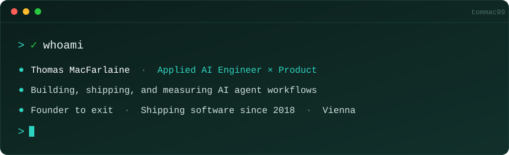

I build applied AI products: RAG pipelines, agent workflows, and the evals that tell you whether they actually work. Software engineer since 2018, founder and CEO of a biotech company through to a planned exit, now doing applied AI full time.

I write the requirements and acceptance criteria, then build against them, because I have worked both sides. Applied rather than research, and deliberately going deeper.

Most of what I ship is client work and lives in private repos, so this profile is thinner than the work behind it. What follows is the honest version of what I have built and what it did.

---

## Selected work

**AI copilot for MEDDEV report authoring**
A Microsoft Word add-in for regulatory and PhD users writing clinical evaluation reports. Document-heavy, precision-critical, expensive to iterate. RAG pipeline with citation-aware retrieval so every suggestion traces back to a source, vector search over the document set, and agent orchestration with LangChain, LangGraph, and ReAct. Prompt and output evals kept suggestion quality measurable rather than judged case by case. End to end mine: discovery, product design, AI architecture, retrieval quality, and the in-editor workflow.

**InfiniCube, an AI product across hardware and software** · [infinicube.at](https://infinicube.at/en)
Product manager on a screen-free play device for ages 3-10 that recognises a child's own toys and turns them into stories, discoveries, and riddles. Owned the roadmap across firmware, app, and content teams. Defined evals for generated output so quality and age-appropriateness were tracked metrics, under hard constraints: volume capped in hardware, no ads, no data collected on children.

**Enterprise Claude rollouts**
Set up Claude environments for client teams end to end: workspace configuration, custom skills, workflow design, and hands-on enablement. Still in daily use after the engagements ended, which is the adoption measure I trust.

**Agent workflows in production**
Built AI agents that added over 1,000 qualified leads to client pipelines, removing hours of manual list building from SDR teams every week. Every workflow runs through prompt and output evals before it touches a live process, because an unmeasured AI feature is a liability.

**Numy FlexCo, founder and CEO** · [numy.tech](https://www.numy.tech)
Solid State Fermentation systems turning industrial organic biomass into a B2B protein alternative. Zero to a patent, a trademark, over €500k raised, a research partnership with one of the largest agri-food companies in the world, and a planned exit. Built the self-hosted dashboard myself, pulling live data off lab equipment so decisions ran on evidence.

---

## Stack

**Product**: discovery interviews, problem framing, requirements and acceptance criteria, RICE and ICE prioritisation, roadmap sequencing, OKRs and North Star metrics, adoption tracking, go-to-market strategy.

---

## Currently

Consulting independently on applied AI, and open to full-time Applied AI Engineer or AI Product Manager roles. Remote or Vienna based, open to hybrid and travel for the right fit. Irish passport, so UK and EU right to work is covered.

## Elsewhere

[LinkedIn](https://www.linkedin.com/in/thomas-macfarlaine/) · [thomas@macfarlaine.cloud](mailto:thomas@macfarlaine.cloud)
